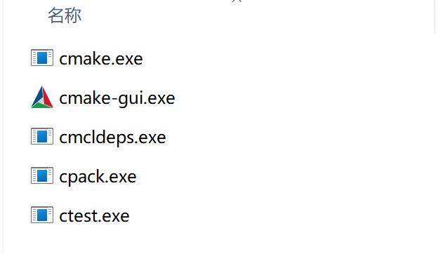
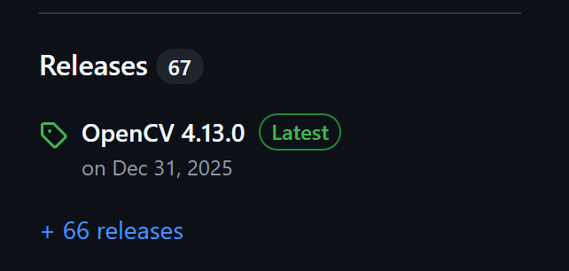
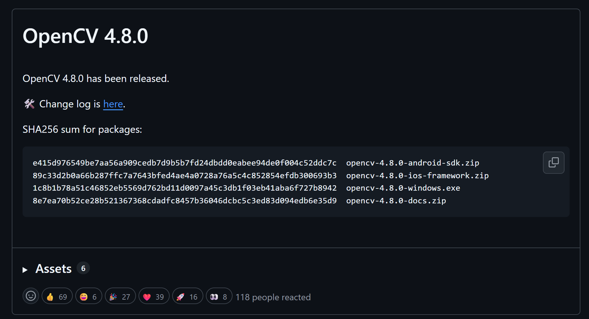
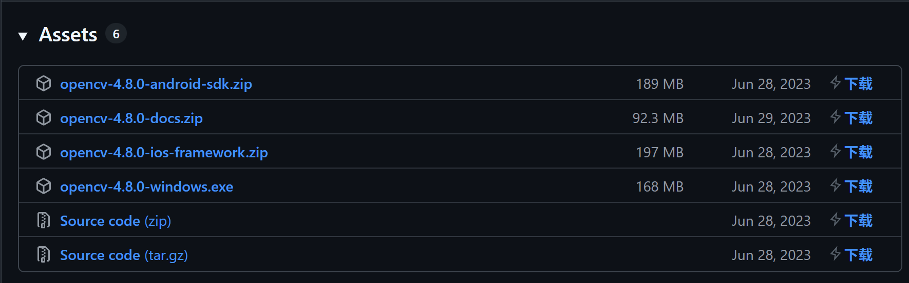
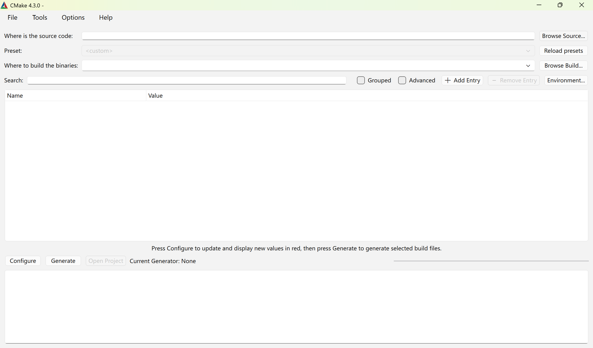
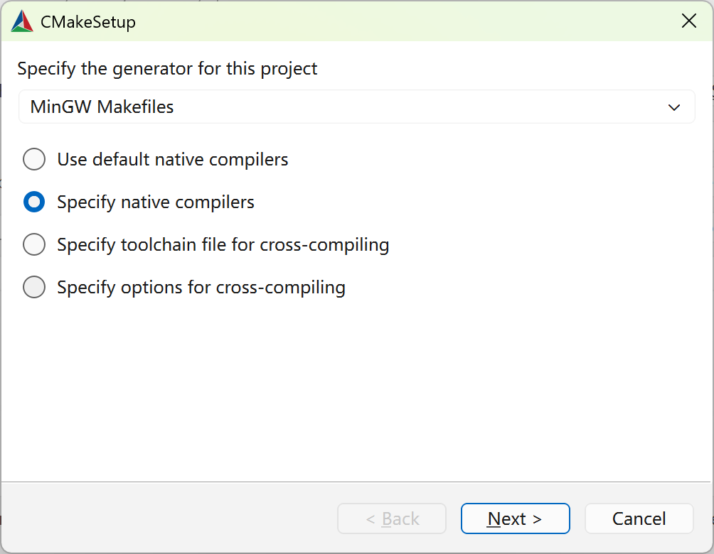
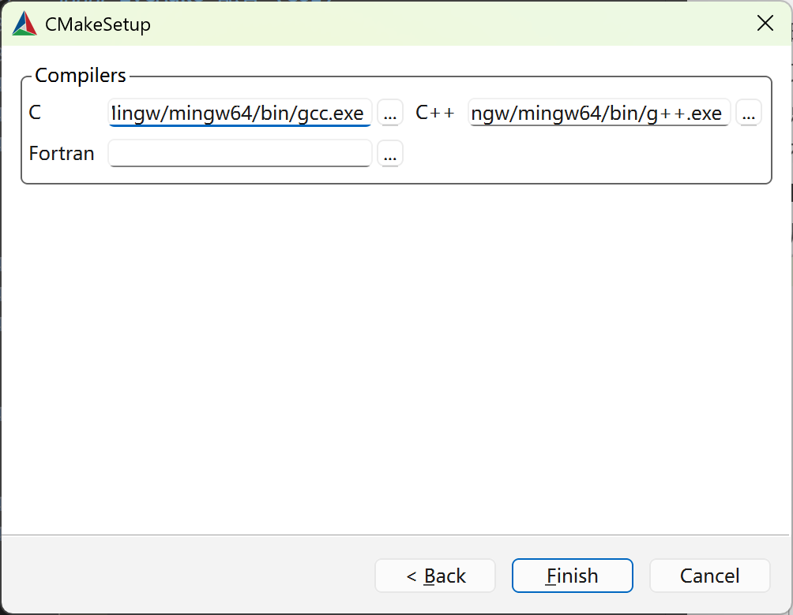
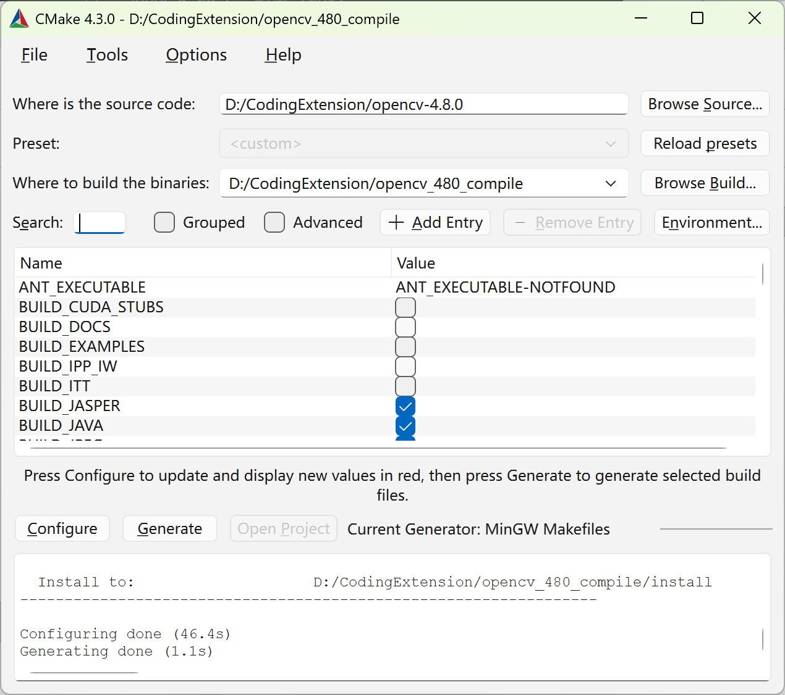
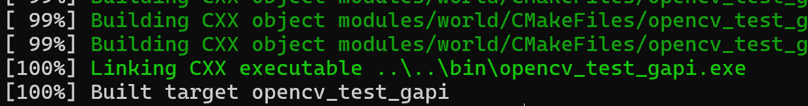

# BUAA宇航学院模式识别实验环境配置教程 

### 项目简介
目前模式识别实验只需要解决opencv的依赖问题，本教程主要介绍如何在Windows环境下用mingw手动编译OpenCV，如果未来实验需要其他库，也可以参考本教程进行。
本教程在 Windows 环境下，使用 **MinGW-w64** 手动编译 **OpenCV 4.8.0**。旨在帮助解决OpenCV官方库只提供针对MSVC的版本问题，以及一些典型兼容性问题。

---
OpenCV-4.8.0在gcc/g++15.1.0下编译的版本：
https://bhpan.buaa.edu.cn/link/AAF55459F90E154984AFD305840EBC599A
文件名：opencv_480_compile.7z
有效期限：永久有效
提取码：bPfh
---

### 测试环境
* **OS**: Windows 11
* **Compiler**: MinGW-w64 (测试使用gcc/g++ 15.1.0)
* **CMake**: 4.3.0
* **OpenCV Source**: v4.8.0

---

### 核心步骤
#### 1. 环境准备
* CMake请在官方网站 https://cmake.org/ 下载安装，推荐安装至D盘，单独创建一个文件夹
  解压完成后，在windows搜索栏中搜索环境变量，在用户变量一栏中选择Path，点击编辑
  在弹出的栏中选择新建，路径为 `YourCMakePath/bin/`，这里的 `YourCMakePath`为你的CMake安装路径，bin文件夹下方有如下文件，确认不要选错路径，输入完成后按 `Enter` 键，连续点击确定，直到所有弹窗都关闭
  
  按下win+R，输入 `cmd` 打开命令行，输入
  ```
  cmake --version
  ```
  确认是否显示出CMake版本信息，如果报错，请重新配置环境变量
* OpenCV请在github仓库 https://github.com/opencv/opencv/ 中下载
  选择右侧栏的 **Releases**
  
  找到所需版本的OpenCV（本教程为v4.8.0，如果mingw版本较高，建议选择较新的opencv版本），点击Assets展开
  
  选择里面的Source code(zip)，下载到本地
  
  解压到D盘一个单开的文件夹，便于后续操作
* mingw下载及配置可以参考 https://zhuanlan.zhihu.com/p/26143367916

#### 2.CMake 配置 (GUI)
* 打开cmd，输入如下命令
  ```
  cmake-gui
  ```
  或者打开刚才设置cmake环境变量的文件夹 `YourCMakePath/bin/`，点击 `cmake-gui.exe`（如果没开后缀显示，则会显示为 `cmake-gui`，打开这个文件就可以）
  如下是CMake GUI的界面截图
  
  **Where is the source code**: 指向opencv源码文件夹，也就是你刚才解压的opencv文件夹，在这个文件夹下有一个 `CMakeList.txt` 文件，确认不要选错路径。
  **Where to build the binaries**: 指向你要将编译后的文件存放的目录，建议新建一个和opencv源码文件夹同级的文件夹。
  点击下方 **Configure** 按钮
  在弹出的弹窗中，下拉栏选择 **MinGW Makefiles**，选择 **Specify native compilers**，随后点击**next**
  
  这里C和C++分别选择你的Mingw路径下bin文件夹里的gcc.exe和g++.exe，Fortran不用管，点击Finish
  
  等待配置完成，这个过程需要一些时间
* **选项调整**：
    在CMake中间的红色栏中，调整以下选项
    * `WITH_OPENGL`：**可以勾选** 
    * `CMAKE_BUILD_TYPE`: 设置为 `Release`
    * `BUILD_opencv_world`: **勾选**
    * `ENABLE_PRECOMPILED_HEADERS`: **取消勾选**
    * `WITH_IPP` / `WITH_TBB`: **取消勾选**
    * `BUILD_EXAMPLES` / `BUILD_TESTS`：**可以取消勾选**
  * 调整完成后再次点击 **Configure** 按钮，等待配置完成，此时中间的红色栏会变回白色，说明配置成功，点击 **Generate** 按钮；否则继续重复以上步骤
  
#### 3.开始编译
  打开你在**Where to build the binaries**中选择的路径文件夹，按住 `Shift`+鼠标右键，选择 **Open in Terminal**，输入
  ```
  mingw32-make # 启用一个线程编译，可能会比较慢
  # 如果你的CPU有多个核心，可以启用多个线程编译，例如：
  mingw32-make -j8 # 8指启用8个线程编译，根据实际情况调整
  ```
  只要没有出现 **Error** 并提前终止就不要管，Warning等信息可以忽略

* **避坑指南**：
  * **错误 A: `uintptr_t` 命名空间报错**
    * *现象*：`error: 'uintptr_t' in namespace 'std' does not name a type`。
    * *修复*：在 CMake 中禁用 `WITH_ADE`。
  * **错误 B: `obsensor` 模板转换失败**
    * *现象*：`error: could not convert template argument...`。
    * *修复*：在 CMake 中搜索并 **取消勾选** `WITH_OBSENSOR` 和 `VIDEOIO_ENABLE_OBSENSOR`（如果有以上选项）。

  * 完成修改后，依次点击 **Configure** ，**Generate** 并再次编译
  * ps: 如果编译过程中有其他错误，建议把报错信息复制给AI咨询解决方案
  
出现以下字样，说明编译成功


**执行安装命令**：在当前终端输入
```
mingw32-make install
```
等待完成即可

#### 4.环境配置与集成

* 打开用户环境变量，选择Path，点击编辑
  在弹出的栏中选择新建，路径为 `Opencv_Compile/install/x64/mingw/bin`，这里的 `Opencv_Compile` 为你在**Where to build the binaries**中选择的路径，输入完成后按 `Enter` 键，连续点击确定，直到所有弹窗都关闭

* 用vscode打开模式识别实验文件夹，打开 `CMakeLists.txt` ，把set那行修改为
```cmake
set(OpenCV_DIR "Opencv_Compile/install")
# Opencv_Compile 为你在Where to build the binaries中选择的路径
```

* 删除build文件夹（如果有），如果删除失败，点击vscode终端的垃圾桶图标，把所有终端进程关掉再重新删除
* 新开一个vscode终端，输入如下命令
  ```
  $env:Path
  ```
  检查你设置的cmake和opencv环境变量是否被列出，如果没有，关闭所有vscode窗口，在windows搜索栏中搜索任务管理器，打开后点击进程，找到vscode进程，点击结束进程，再重新打开vscode终端检查
* 点击左下角生成，等待生成完成
  
* 点击左下角运行符号，此时应该能够成功运行，整个过程全部完成
